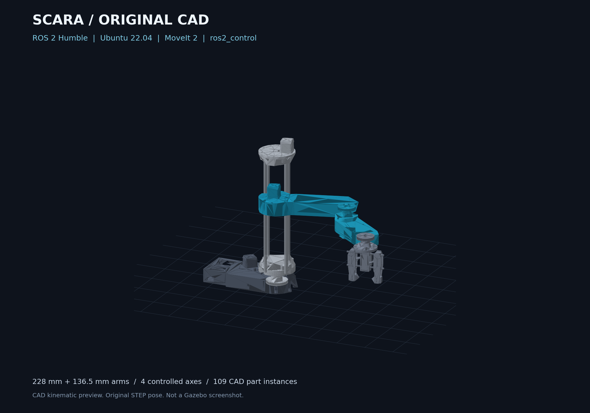

# SCARA Robot · ROS 2 Humble

**Four-axis SCARA manipulator · Original CAD geometry · ros2_control · MoveIt 2 · Gazebo · RViz2**

A ROS 2 workspace built around the SCARA assembly and embedded code from [Matthew Garcia's original SCARA repository](https://github.com/Matthew-Garcia/SCARA-Robot). This repository brings the mechanical files, Arduino firmware, Processing GUI, analytical kinematics, and simulation setup into one organized project.

**Target environment:** Ubuntu 22.04 LTS + ROS 2 Humble + Gazebo Classic 11.

## Robot Demonstrations

### Physical SCARA Robot


Physical four-axis SCARA manipulator demonstrating basic joint motion and operation of the original hardware.

### ROS 2 Gazebo + RViz2 Simulation

https://github.com/user-attachments/assets/899a8b08-be5f-4084-b404-54a212bec7f7

ROS 2 Humble simulation of the SCARA manipulator running in Gazebo and RViz2 with `ros2_control` and MoveIt 2 for joint control, motion planning, and trajectory execution.

## CAD Model



*Preview rendered from the original STEP assembly. This is a CAD visualization, not a screenshot of a running Gazebo session.*

## Start here

*Preview rendered from the original STEP assembly. This is a CAD visualization, not a screenshot of a running Gazebo session.*

## Start here

- [Install, build, and launch the ROS workspace](ros2_ws/README.md)
- [Robot frames and forward/inverse kinematics](docs/kinematics.md)
- [Cube, sphere, and three-piece Hanoi scene](docs/manipulation-scene.md)
- [What has been tested](docs/validation.md)
- [Physical hardware integration requirements](docs/hardware-integration.md)
- [Original asset locations and preservation](docs/repository-layout.md)

## Capabilities and status

| Component | Included | Validation status |
| --- | --- | --- |
| Robot description | Original STEP converted into five rigid links, with 109 CAD part instances | Source hashes and assembly-frame reconstruction checked |
| Kinematics | Four-axis analytical FK/IK; elbow branches, joint limits, angle wraps, yaw | 10,000 standalone C++ round trips passed |
| ros2_control | Joint-state broadcaster and arm trajectory controller; Gazebo/mock backends | Humble runtime verification pending |
| MoveIt 2 | Custom analytical plugin, OMPL planning, trajectory execution configuration | Humble plugin build and integration verification pending |
| Visualization | RViz2 configuration and Gazebo Classic world/launch | GUI runtime verification pending |
| Manipulation scene | Dynamic cube, sphere and three Hanoi rings; matching MoveIt collision world | Scene geometry parity checked; physics/grasp runtime pending |
| Embedded code | Original Arduino stepper/servo controller and Processing GUI | Preserved without modifying their behavior |
| Gripper | Original CAD opening and mechanism represented visually | Actuation and simulated grasping are not implemented |

Simulation mass properties and collision hulls are approximations. This project does not claim verified payload, torque, positioning accuracy, or a feedback-based physical ROS controller.

## Repository structure

| Directory | Purpose |
| --- | --- |
| [`cad/solidworks/`](cad/solidworks/) | Original SolidWorks assemblies and part files, with original filenames |
| [`cad/step/`](cad/step/) | Complete robot STEP assembly and individual STEP exports |
| [`firmware/arduino/SCARA_Robot/`](firmware/arduino/SCARA_Robot/) | Original Arduino sketch, in an IDE-compatible sketch folder |
| [`software/processing/GUI_for_SCARA_Robot/`](software/processing/GUI_for_SCARA_Robot/) | Original Processing GUI, in its matching sketch folder |
| [`ros2_ws/src/`](ros2_ws/src/) | Description, kinematics, MoveIt configuration, and bringup packages |
| [`ros2_ws/tests/`](ros2_ws/tests/) | Geometry, provenance, and standalone kinematics checks |
| [`tools/`](tools/) | CAD export, preview rendering, and ROS integration runner |
| [`docs/`](docs/) | Setup context, kinematics, validation, provenance, and hardware notes |
| [`media/original/`](media/original/) | Original robot photograph and animation |
| [`docker/`](docker/) | Reproducible Ubuntu 22.04/Humble build environment |
| [`.github/workflows/`](.github/workflows/) | Humble build and headless simulation checks |

## Publish this prepared repository from Windows

After extracting the ZIP, open Command Prompt in this folder. Git and GitHub CLI must be installed and signed in as `Matthew-Garcia`.

```bat
publish-github.cmd
```

This creates **a new private repository** named `SCARA-Robot-ROS2` and pushes these files. To make the new repository public instead, explicitly run `publish-github.cmd public`. The script refuses to overwrite an existing repository or reuse an existing origin remote. The original `SCARA-Robot` repository is not modified.

## Build and launch

After installing the dependencies in the [setup guide](ros2_ws/README.md):

```bash
git clone https://github.com/Matthew-Garcia/SCARA-Robot-ROS2.git
cd SCARA-Robot-ROS2/ros2_ws
source /opt/ros/humble/setup.bash
rosdep install --from-paths src --ignore-src --rosdistro humble -r -y
colcon build --symlink-install
source install/setup.bash
ros2 launch scara_bringup sim.launch.py
```

RViz/MoveIt with mock joint feedback:

```bash
ros2 launch scara_bringup sim.launch.py mode:=mock
```

Send a Cartesian target through MoveIt from another sourced terminal:

```bash
ros2 run scara_bringup move_to_pose.py --x 0.33 --y 0.02 --z 0.09 --yaw 0
```

The original robot has four controlled axes: shoulder rotation, vertical carriage motion, elbow rotation, and wrist yaw. Roll and pitch commands are unreachable.

## Docker build

From the repository root:

```bash
docker build -f docker/Dockerfile -t scara-ros2:humble .
# Headless simulation; no desktop display required.
docker run --rm scara-ros2:humble bash -lc \
  'source /opt/ros/humble/setup.bash && source /scara_ws/install/setup.bash && ros2 launch scara_bringup sim.launch.py gui:=false rviz:=false'
```

For GUI use, follow the native Ubuntu setup. The Dockerfile does not configure host display forwarding.

## Original project and attribution

The original repository is retained separately. Its 77 files are preserved byte-for-byte in this new layout, including an [archived copy of its README](docs/archive/original-readme.md). The [source manifest](docs/source_manifest.json) records every old/new path, SHA-256 hash, and original commit. Statements in the archived README are historical source text; the capability table above and validation record describe the current ROS addition.

CAD and embedded code retain their source provenance. The original repository does not include a top-level license file; no blanket relicensing of those assets is implied by the new ROS package metadata.
